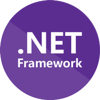

# Hello World
`git config --global user.name "Matheus Fontana"`

During my free time, I like design intuitive end-to-end intuitive Web solutions and develop them using my full stack development toolkit.

Currently working as a **Software Developer Engineer Grad** and responsible for the development of mediation scripts using CGDC (Compiled Generalized Data Conversion) and Python 3.

### 🛠️ **My Development Toolkit**

### 🗨️ **Reach me out** via [Linkedin](https://www.linkedin.com/in/matheusfontana)
